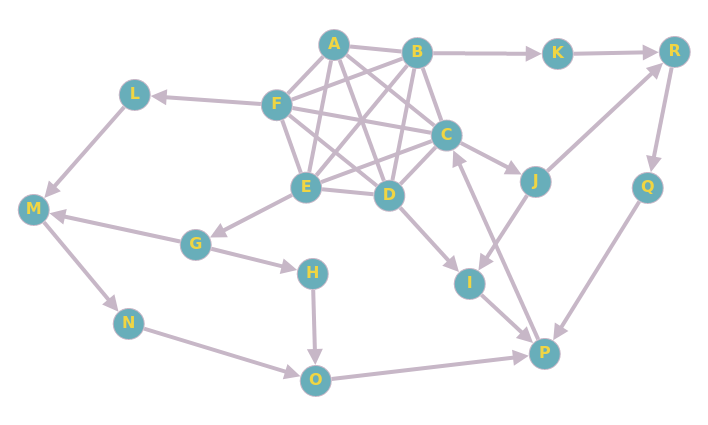

create this topology from this adjacency matrix (this graph was created using https://graphonline.ru/en/)


```
0, 1, 1, 1, 1, 1, 0, 0, 0, 0, 0, 0, 0, 0, 0, 0, 0, 0, a
1, 0, 1, 1, 1, 1, 0, 0, 0, 0, 1, 0, 0, 0, 0, 0, 0, 0, b
1, 1, 0, 1, 1, 1, 0, 0, 0, 1, 0, 0, 0, 0, 0, 0, 0, 0, c
1, 1, 1, 0, 1, 1, 0, 0, 1, 0, 0, 0, 0, 0, 0, 0, 0, 0, d
1, 1, 1, 1, 0, 1, 1, 0, 0, 0, 0, 0, 0, 0, 0, 0, 0, 0, e
1, 1, 1, 1, 1, 0, 0, 0, 0, 0, 0, 1, 0, 0, 0, 0, 0, 0, f
0, 0, 0, 0, 0, 0, 0, 1, 0, 0, 0, 0, 1, 0, 0, 0, 0, 0, g
0, 0, 0, 0, 0, 0, 0, 0, 0, 0, 0, 0, 0, 0, 1, 0, 0, 0, h
0, 0, 0, 0, 0, 0, 0, 0, 0, 0, 0, 0, 0, 0, 0, 1, 0, 0, i
0, 0, 0, 0, 0, 0, 0, 0, 1, 0, 0, 0, 0, 0, 0, 0, 0, 1, j
0, 0, 0, 0, 0, 0, 0, 0, 0, 0, 0, 0, 0, 0, 0, 0, 0, 1, k
0, 0, 0, 0, 0, 0, 0, 0, 0, 0, 0, 0, 1, 0, 0, 0, 0, 0, l
0, 0, 0, 0, 0, 0, 0, 0, 0, 0, 0, 0, 0, 1, 0, 0, 0, 0, m
0, 0, 0, 0, 0, 0, 0, 0, 0, 0, 0, 0, 0, 0, 1, 0, 0, 0, n
0, 0, 0, 0, 0, 0, 0, 0, 0, 0, 0, 0, 0, 0, 0, 1, 0, 0, o
0, 0, 1, 0, 0, 0, 0, 0, 0, 0, 0, 0, 0, 0, 0, 0, 0, 0, p
0, 0, 0, 0, 0, 0, 0, 0, 0, 0, 0, 0, 0, 0, 0, 1, 0, 0, q
0, 0, 0, 0, 0, 0, 0, 0, 0, 0, 0, 0, 0, 0, 0, 0, 1, 0  r
```

In java, you can use this syntax to initialize the matrix:
  int[][] matrix = { { 0, 1, 1, 1, 1, 1, 0, 0, 0, 0, 0, 0, 0, 0, 0, 0, 0, 0}, { 1, 0, 1, 1, 1, 1, 0, 0, 0, 0, 1, 0, 0, 0, 0, 0, 0, 0}  .....  };

implement a controlled flooding algorithm (with a sequence number) and add a value called "length" to the message.
When an actor receives a message, it increments the "lentgh" by 1 and transmits the message with the incremented value to its neighbors.
Be careful to modify the controlled flooding algorithm so that even if an actor already received a message with the same sequence number, this times it does transmit it to its neigbors if the length is inferior to the one received before. This means that for each sequence number, all actors have to store the corresponding length.

Run the algorithm by starting with actor A and answer those questions: 
- how many messages are received by P ? 4
- What is the lowest value "length" received by P ? 3
  from A
  A received message with sequence number: 0, length: 0
  B received message with sequence number: 0, length: 1
  F received message with sequence number: 0, length: 1
  E received message with sequence number: 0, length: 1
  B received message with sequence number: 0, length: 2
  F received message with sequence number: 0, length: 2
  B received message with sequence number: 0, length: 2
  E received message with sequence number: 0, length: 2
  L received message with sequence number: 0, length: 2
  C received message with sequence number: 0, length: 1
  M received message with sequence number: 0, length: 3
  B received message with sequence number: 0, length: 2
  C received message with sequence number: 0, length: 2
  N received message with sequence number: 0, length: 4
  C received message with sequence number: 0, length: 2
  D received message with sequence number: 0, length: 1
  C received message with sequence number: 0, length: 2
  C received message with sequence number: 0, length: 2
  D received message with sequence number: 0, length: 2
  I received message with sequence number: 0, length: 2
  O received message with sequence number: 0, length: 5
  P received message with sequence number: 0, length: 3 'x
  J received message with sequence number: 0, length: 2
  P received message with sequence number: 0, length: 6 '
  E received message with sequence number: 0, length: 2
  G received message with sequence number: 0, length: 2
  F received message with sequence number: 0, length: 2
  H received message with sequence number: 0, length: 3
  K received message with sequence number: 0, length: 2
  A received message with sequence number: 0, length: 2
  O received message with sequence number: 0, length: 4
  M received message with sequence number: 0, length: 3
  F received message with sequence number: 0, length: 2
  F received message with sequence number: 0, length: 2
  E received message with sequence number: 0, length: 2
  E received message with sequence number: 0, length: 2
  I received message with sequence number: 0, length: 3
  R received message with sequence number: 0, length: 3
  C received message with sequence number: 0, length: 4
  R received message with sequence number: 0, length: 3
  Q received message with sequence number: 0, length: 4
  D received message with sequence number: 0, length: 2
  B received message with sequence number: 0, length: 2
  D received message with sequence number: 0, length: 2
  P received message with sequence number: 0, length: 5 '
  A received message with sequence number: 0, length: 2
  P received message with sequence number: 0, length: 5 '
  D received message with sequence number: 0, length: 2
  A received message with sequence number: 0, length: 2
  A received message with sequence number: 0, length: 2
  A received message with sequence number: 0, length: 2
- 
Now run the algorithm by starting with actor L and answer those questions:
- how many messages are received by P ? 3
- What is the lowest value "length" received by P ? 4
  from L
  L received message with sequence number: 1, length: 0
  M received message with sequence number: 1, length: 1
  N received message with sequence number: 1, length: 2
  O received message with sequence number: 1, length: 3
  P received message with sequence number: 1, length: 4 'x
  C received message with sequence number: 1, length: 5
  A received message with sequence number: 1, length: 6
  D received message with sequence number: 1, length: 6
  B received message with sequence number: 1, length: 6
  J received message with sequence number: 1, length: 6
  B received message with sequence number: 1, length: 7
  K received message with sequence number: 1, length: 7
  E received message with sequence number: 1, length: 6
  A received message with sequence number: 1, length: 7
  C received message with sequence number: 1, length: 7
  G received message with sequence number: 1, length: 7
  C received message with sequence number: 1, length: 7
  M received message with sequence number: 1, length: 8
  H received message with sequence number: 1, length: 8
  A received message with sequence number: 1, length: 7
  O received message with sequence number: 1, length: 9
  E received message with sequence number: 1, length: 7
  B received message with sequence number: 1, length: 7
  R received message with sequence number: 1, length: 7
  F received message with sequence number: 1, length: 6
  D received message with sequence number: 1, length: 7
  D received message with sequence number: 1, length: 7
  L received message with sequence number: 1, length: 7
  I received message with sequence number: 1, length: 7
  I received message with sequence number: 1, length: 7
  D received message with sequence number: 1, length: 7
  F received message with sequence number: 1, length: 7
  Q received message with sequence number: 1, length: 8
  R received message with sequence number: 1, length: 8
  B received message with sequence number: 1, length: 7
  B received message with sequence number: 1, length: 7
  E received message with sequence number: 1, length: 7
  A received message with sequence number: 1, length: 7
  C received message with sequence number: 1, length: 7
  A received message with sequence number: 1, length: 7
  C received message with sequence number: 1, length: 7
  E received message with sequence number: 1, length: 7
  F received message with sequence number: 1, length: 7
  E received message with sequence number: 1, length: 7
  D received message with sequence number: 1, length: 7 
  P received message with sequence number: 1, length: 8 '
  P received message with sequence number: 1, length: 9 '
  F received message with sequence number: 1, length: 7
  C received message with sequence number: 1, length: 7
  F received message with sequence number: 1, length: 7
Now run the algorithm by starting with actor I and answer those questions:
- how many messages are received by Q ? 2 
- What is the lowest value "length" received by Q ? 5
  from I
  I received message with sequence number: 2, length: 0
  P received message with sequence number: 2, length: 1 
  C received message with sequence number: 2, length: 2
  A received message with sequence number: 2, length: 3
  B received message with sequence number: 2, length: 3
  C received message with sequence number: 2, length: 4
  A received message with sequence number: 2, length: 4
  C received message with sequence number: 2, length: 4
  K received message with sequence number: 2, length: 4
  E received message with sequence number: 2, length: 3
  R received message with sequence number: 2, length: 5
  Q received message with sequence number: 2, length: 6 'x
  C received message with sequence number: 2, length: 4
  P received message with sequence number: 2, length: 7
  E received message with sequence number: 2, length: 4
  E received message with sequence number: 2, length: 4
  D received message with sequence number: 2, length: 3
  G received message with sequence number: 2, length: 4
  A received message with sequence number: 2, length: 4
  M received message with sequence number: 2, length: 5
  F received message with sequence number: 2, length: 3
  N received message with sequence number: 2, length: 6
  J received message with sequence number: 2, length: 3
  B received message with sequence number: 2, length: 4
  B received message with sequence number: 2, length: 4
  B received message with sequence number: 2, length: 4
  L received message with sequence number: 2, length: 4
  F received message with sequence number: 2, length: 4
  F received message with sequence number: 2, length: 4
  M received message with sequence number: 2, length: 5
  O received message with sequence number: 2, length: 7
  A received message with sequence number: 2, length: 4
  D received message with sequence number: 2, length: 4
  I received message with sequence number: 2, length: 4
  E received message with sequence number: 2, length: 4
  C received message with sequence number: 2, length: 4
  H received message with sequence number: 2, length: 5
  C received message with sequence number: 2, length: 4
  O received message with sequence number: 2, length: 6
  E received message with sequence number: 2, length: 4
  I received message with sequence number: 2, length: 4
  D received message with sequence number: 2, length: 4
  P received message with sequence number: 2, length: 8
  A received message with sequence number: 2, length: 4
  F received message with sequence number: 2, length: 4
  F received message with sequence number: 2, length: 4
  B received message with sequence number: 2, length: 4
  R received message with sequence number: 2, length: 4
  P received message with sequence number: 2, length: 7
  Q received message with sequence number: 2, length: 5 'x
  D received message with sequence number: 2, length: 4
  P received message with sequence number: 2, length: 6
  D received message with sequence number: 2, length: 4

shortest path from 1 dest :O